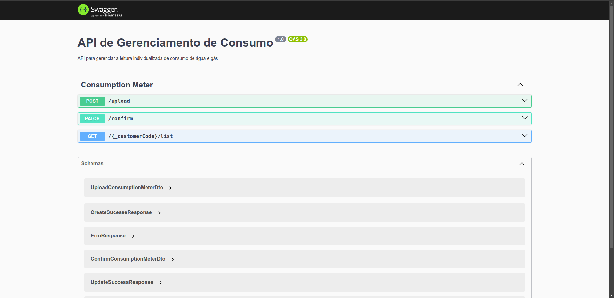

# Teste Shopper

## Author
Me chamo João Vitor, tenho 24 anos e amo desenvolver. Meus hobbies favoritos são passar tempo com minha esposa, jogar e estar com meu cachorrinho.

Sou uma pessoa que gosta muito de aprender, estudar e compartilhar conhecimentos.

No desenvolvimento deste projeto, me esforcei ao máximo para dar o meu melhor. Tive que aprender como integrar com o Google para realizar os envios das imagens e fazer algumas configurações novas no framework.

## Introduction
Para o desenvolvimento desta api foi utilizado um framework express chamado NestJS na versão `10.4.1`.
A versão do node é `20.13.1`.

### Server

#### Start project

Para iniciar o projeto, é necessário configurar previamente a variável de ambiente com a API KEY do Google Gemini. Essa chave pode ser obtida seguindo o passo a passo fornecido pelo próprio Google. <a href="https://ai.google.dev/gemini-api/docs/api-key?hl=pt-br">click aqui e saiba mais!</a>

Para um auxilio estou disponibilidando um arquivo por padrão chamado <code>.env-exemple</code> onde nele esta como a variavel da api deve estar configurada para o sistema funcionar.

Para copiar basta executar (na pasta do projeto)
```sh
cp .env-example .env
```
Isso irá gerar um arquivo `.env` na raiz do projeto, onde será necessário alterar o valor da variável pela sua API KEY.

#### Run project
O projeto está containerizado com Docker. Para rodá-lo, primeiramente você deve baixar e instalar o Docker. Para isso, utilize o site oficial do <a href="https://www.docker.com/">docker</a>. 
Após a instalação, basta rodar o comando `docker compose up -d`. Dessa forma, o build da aplicação será realizado e os containers necessários para o funcionamento serão iniciados.

Nesta aplicação foi utilizado o Swagger para documentação. Então, ao acessar `localhost:3000` você poderá visualizar a documentação no navegador.


#### Observations
Para converter as imagens em base64 utilizei o site <a href="https://www.base64-image.de/">BASE64IMAGE</a>. Paras os testes usei algumas imagens de exemplo.


## Database
Como banco de dados, utilizei o MySQL, que ao executar o comando `docker compose up -d` será iniciado em um container junto com a aplicação, garantindo o funcionamento completo do sistema. Com isso, basta utilizar a aplicação normalmente.